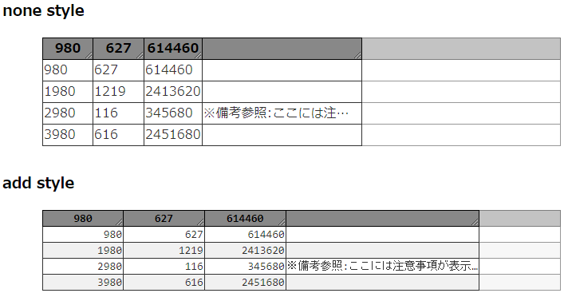

# `[tym-directive]`
`tym-directive` は，`angular` の極小のディレクティブです。

## インストール `(Installation)`
<br>

次のコマンド実行します。
```
npm install tym-directive
```

<br>

## 目次 (Table of contents)
<br>

1. [エレメントのリサイズ処理](#TymResize)
1. [簡易テーブル表示](#TymTableView)
1. please wait...

<br> 

---

<br>

<a id="TymResize"></a>

## エレメントのリサイズ処理 `(tym-resize)`
<br>

任意の `html` エレメント に対してリサイズ時の処理を行えるようにします。

- 使い方:

``` html
<div tym-resize [tymResizeCallback]="callback">
  :
</div>
```

- ディレクティブを利用できるようにします。

``` typescript :app.module.ts
  :
import { TymDirectiveModule } from "tym-directive";
  :
@NgModule({
  declarations: [ .. ],
  imports: [ TymDirectiveModule ],
  :
```

- コールバック関数を実装します。

``` typescript :app.component.ts
  :
  @Output() callback(thisElm: HTMLElement, parentElm: HTMLElement) {
    parentElm.style.width = thisElm.style.width;
    parentElm.style.height = thisElm.style.height;
  }
  :
```

<br> 

---

<br>

<a id="TymTableView"></a>

## 簡易テーブル表示 `(tym-table-view)`
<br>

任意の`html`エレメントに対してリサイズ時の処理を行えるようにします。

- 使い方:

``` html
<tym-table-view
  [cols]="cols"
  [data]="data"
></tym-table-view>
```

- 表示するためのデータを用意します。

``` typescript
let cols: string[] = [ "単価", "販売数", "売上" ]
let data = [
  [ 980, 627, 614460 ],
  [ 1980, 1219, 2413620 ],
  [ 2980, 116, 345680 ]
]; 
``` 

- 必要に応じてスタイルシートを用意します。

``` style.css
tym-table-view>table {
  font-family: Consolas, monaco, monospace;
  font-size: 14px;
}
tym-table-view>table tbody tr:nth-child(even)>* {
  background-color: #eee;
}
tym-table-view>table tbody tr:nth-child(odd)>* {
  background-color: #fff;
}
tym-table-view>table thead tr th {
  width: 6em;
}
tym-table-view>table tbody tr td {
  text-align: right;
}
```



<br/>

### ライセンス (License)
The components in tym-ng-ws are released under the MIT license. [Read license](//github.com/shinichi-tym/tym-ng-ws/blob/main/LICENSE).

---
Copyrights belong to shinichi tayama (shinichi.tym).
